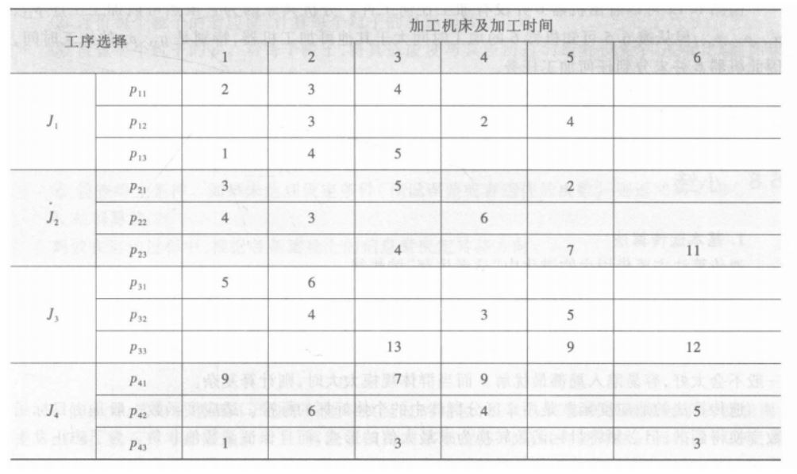
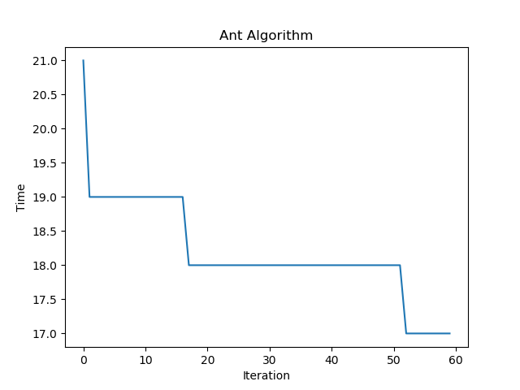

## 蚁群算法解决车间调度问题

### 问题描述

柔性作业车间调度问题：某加工系统有6台机床，要加工4个工件，每个工件有3道工序，如下表所示，比如工序p11代表第一件工件的第一道工序，可由机床1用2h完成，或由机床2用3h完成，或由机床3用4h完成。

### 思路借鉴

感谢该作者：[https://github.com/bz51/AntColonyAlgorithm](https://github.com/bz51/AntColonyAlgorithm)

但本问题稍有不同，即任务之间有先后顺序性，具体解决请参看代码

## 典型结果

尝试选取了比较有代表性的一次实验结果：

